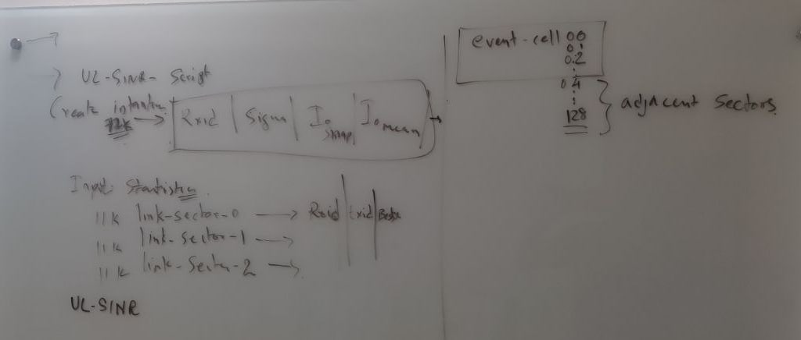

# Workflow of the Packet Transmission Modelling

## Uplink Interference statistics

Objective is to capture the statistics of the interference generated from adjacent cells to Center-Cell 0 

**Assumptions**

- 600 Devices/cell : RxID, TxID , CouplingLoss
  
  - Filter 
    
    1. 600devices towards Cell 0/ Sector 0,1,2
    
    2. devices not associated with cell 0 

- Uplink Interference of *Cell0* 500 devices statistics

No Shadow, 112-Electrical Tilt

# New Simulation Set

### 80k Devices , eventsinr-80k

- Update results with Relay and channels 
